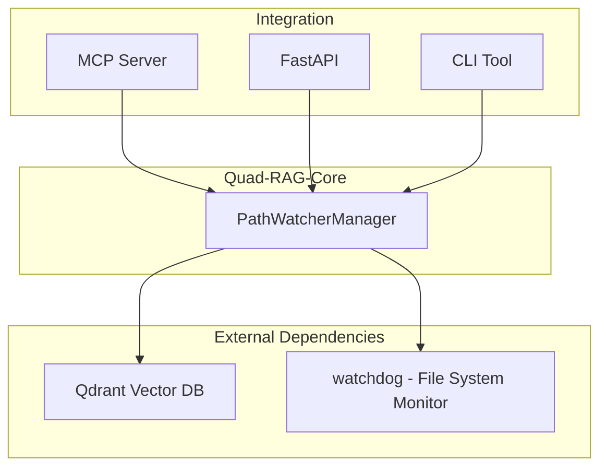

# Quad-RAG-Core

<div align="center">

**Autonomous Semantic RAG-based Search for Local Files**


English | [Русский](README_Ru.md)

</div>

---

## Description

**Quad-RAG-Core** is a Python middleware module library for semantic search systems on local folders with Qdrant vector database

and automatic file change tracking and index maintenance.

### Key Features

🔍 **Automatic file tracking** — monitors file creation, modification, moving, and deletion via `watchdog`

🔄 **Automatic index updates** — when a file changes, old chunks are deleted and new ones are recalculated

💾 **State persistence** — configuration stored in Qdrant, automatic restoration after restart

🤖 **Local models** — embeddings via `nomic-embed-text-v2-moe`, reranking via `BGE-reranker-v2-m3`

📄 **Multiple format support** — text files (code, markdown, JSON) and PDF with multiple backends

🔌 **Framework-agnostic** — easily integrates with MCP, FastAPI, CLI, and other protocols

⚡ **GPU acceleration** — automatic CUDA usage when available

## Components

| Component | Description |
|-----------|-------------|
| [`PathWatcherManager`](quad_rag_core/path_manager.py) | Orchestrator — manages watchers, Qdrant collections |
| [`RAGFileWatcher`](quad_rag_core/path_watcher.py) | File system event handler via watchdog |
| [`QdrantManager`](quad_rag_core/qdrant_manager.py) | Wrapper around Qdrant Client |
| [`LocalEmbedder`](quad_rag_core/embedder.py) | Singleton for embeddings (nomic-embed-text) |
| [`LocalReranker`](quad_rag_core/reranker.py) | Singleton for reranking (BGE-reranker) |
| [`FileProcessor`](quad_rag_core/file_processor.py) | Text extraction from files and chunking |
| [`config.py`](quad_rag_core/config.py) | System configuration |
| [`utils.py`](quad_rag_core/utils.py) | Utilities: hashing, MIME types, path normalization |

## Architecture



## Supported File Formats

### Text Files
- Programming languages: `.py`, `.js`, `.ts`...
- Config files and scripts: `.yaml`, `.yml`, `.toml`...
- Markup and web: `.md`, `.txt`, `.json`...

### PDF Files
Support with three backends for maximum compatibility:
PyPDF2, PyMuPDF (fitz), pdfplumber](url)

---
## Installation

### Requirements

- Python 3.10 or higher
- Qdrant server (default: `localhost:6333`)
- Optional: CUDA-compatible GPU for acceleration

### Install Dependencies

```bash
pip install -r requirements.txt
```

### Start Qdrant

```bash
docker run -p 6333:6333 qdrant/qdrant
```

---

## Quick Start

### Basic Usage

```python
from quad_rag_core.path_manager import PathWatcherManager
from quad_rag_core.qdrant_manager import QdrantManager
from quad_rag_core.embedder import LocalEmbedder
from quad_rag_core.reranker import LocalReranker

# Initialization
qdrant_manager = QdrantManager(host="localhost", port=6333)
embedder = LocalEmbedder()
path_manager = PathWatcherManager(qdrant_manager, embedder)

# Start watching a folder
path_manager.watch_folder("/path/to/your/codebase", content_types=["text", "pdf"])

# Search
query_vector = embedder.embed_query("how does authentication work?")
results = qdrant_manager.search("rag_your_codebase", query_vector, limit=10)

# Reranking for improved accuracy
reranker = LocalReranker()
chunks = [r.payload.get("content_preview", "") for r in results]
reranked = reranker.rerank("how does authentication work?", chunks, top_k=5)

# Output results
for chunk, score in reranked:
    print(f"Score: {score:.4f}")
    print(f"Content: {chunk[:200]}...")
    print("-" * 50)
```

### Getting Watcher Status

```python
# Get status of all watched folders
folders = path_manager.get_watched_folders()

for folder in folders:
    print(f"Path: {folder['path']}")
    print(f"Status: {folder['status']}")
    print(f"Progress: {folder['progress_percent']}%")
    print(f"Collection: {folder['collection_name']}")
    print("-" * 50)
```

---


## Configuration

All settings are in [`config.py`](quad_rag_core/config.py):

```python
# Chunk size (words)
CHUNK_SIZE_WORDS = 150

# Overlap between chunks (15%)
CHUNK_OVERLAP_RATIO = 0.15

# Similarity threshold for search
SEARCH_SCORE_THRESHOLD = 0.150

# Preview length in payload
CHUNK_CHARACTERS_PREVIEW = 100

# Threshold for reranking
RERANK_SCORE_THRESHOLD = 0.35
```

## Integration

### MCP Server

```python
from quad_rag_core.path_manager import PathWatcherManager
from quad_rag_core.qdrant_manager import QdrantManager
from quad_rag_core.embedder import LocalEmbedder
from quad_rag_core.reranker import LocalReranker

# Create manager
pm = PathWatcherManager(
    QdrantManager(host="localhost", port=6333),
    LocalEmbedder()
)

# MCP tools
@mcp.tool()
def watch_folder(path: str, content_types: list = ["text"]):
    """Start watching a folder"""
    pm.watch_folder(path, content_types)

@mcp.tool()
def search(query: str, collection: str, limit: int = 10):
    """Perform semantic search"""
    embedder = LocalEmbedder()
    qdrant = QdrantManager()
    reranker = LocalReranker()
    
    # Vector search
    vector = embedder.embed_query(query)
    results = qdrant.search(collection, vector, limit=limit)
    
    # Reranking
    chunks = [r.payload.get("content_preview", "") for r in results]
    reranked = reranker.rerank(query, chunks, top_k=limit)
    
    return [
        {"content": chunk, "score": float(score)}
        for chunk, score in reranked
    ]

@mcp.tool()
def get_status():
    """Get status of all watchers"""
    return pm.get_watched_folders()
```

### FastAPI Web Interface

```python
from fastapi import FastAPI
from quad_rag_core.path_manager import PathWatcherManager
from quad_rag_core.qdrant_manager import QdrantManager
from quad_rag_core.embedder import LocalEmbedder
from quad_rag_core.reranker import LocalReranker

app = FastAPI()
pm = PathWatcherManager(QdrantManager(), LocalEmbedder())

@app.post("/watch")
async def watch_folder(path: str, content_types: list = ["text"]):
    """Start watching a folder"""
    pm.watch_folder(path, content_types)
    return {"status": "watching", "path": path}

@app.get("/search")
async def search(query: str, collection: str, limit: int = 10):
    """Perform semantic search"""
    embedder = LocalEmbedder()
    qdrant = QdrantManager()
    reranker = LocalReranker()
    
    vector = embedder.embed_query(query)
    results = qdrant.search(collection, vector, limit=limit)
    
    chunks = [r.payload.get("content_preview", "") for r in results]
    reranked = reranker.rerank(query, chunks, top_k=limit)
    
    return {
        "query": query,
        "results": [
            {"content": chunk, "score": float(score)}
            for chunk, score in reranked
        ]
    }

@app.get("/status")
async def get_status():
    """Get status of all watchers"""
    return pm.get_watched_folders()

@app.delete("/unwatch")
async def unwatch_folder(path: str):
    """Stop watching a folder"""
    pm.unwatch_folder(path)
    return {"status": "unwatched", "path": path}
```

### CLI Utility

```python
import click
from quad_rag_core.path_manager import PathWatcherManager
from quad_rag_core.qdrant_manager import QdrantManager
from quad_rag_core.embedder import LocalEmbedder
from quad_rag_core.reranker import LocalReranker

@click.group()
def cli():
    """CLI for Quad-RAG-Core"""
    pass

@cli.command()
@click.argument('path')
@click.option('--content-types', default='text', help='Content types: text, pdf')
def watch(path, content_types):
    """Start watching a folder"""
    pm = PathWatcherManager(QdrantManager(), LocalEmbedder())
    pm.watch_folder(path, content_types.split(','))
    click.echo(f"Watching folder: {path}")

@cli.command()
@click.argument('query')
@click.argument('collection')
@click.option('--limit', default=10, help='Number of results')
def search(query, collection, limit):
    """Perform search"""
    embedder = LocalEmbedder()
    qdrant = QdrantManager()
    reranker = LocalReranker()
    
    vector = embedder.embed_query(query)
    results = qdrant.search(collection, vector, limit=limit)
    chunks = [r.payload.get("content_preview", "") for r in results]
    reranked = reranker.rerank(query, chunks, top_k=limit)
    
    for chunk, score in reranked:
        click.echo(f"[{score:.4f}] {chunk[:100]}...")

@cli.command()
def status():
    """Show status"""
    pm = PathWatcherManager(QdrantManager(), LocalEmbedder())
    folders = pm.get_watched_folders()
    
    for folder in folders:
        click.echo(f"{folder['path']}: {folder['status']} ({folder['progress_percent']}%)")

if __name__ == '__main__':
    cli()
```

---

## Usage Examples

### Searching Codebase

```python
from quad_rag_core.path_manager import PathWatcherManager
from quad_rag_core.qdrant_manager import QdrantManager
from quad_rag_core.embedder import LocalEmbedder
from quad_rag_core.reranker import LocalReranker

# Initialize
pm = PathWatcherManager(QdrantManager(), LocalEmbedder())

# Watch project folder
pm.watch_folder("/home/user/myproject", content_types=["text"])

# Search for authentication function
embedder = LocalEmbedder()
qdrant = QdrantManager()
reranker = LocalReranker()

query = "where is the login function?"
vector = embedder.embed_query(query)
results = qdrant.search("rag_home_user_myproject", vector, limit=20)

chunks = [r.payload.get("content_preview", "") for r in results]
reranked = reranker.rerank(query, chunks, top_k=5)

# Output results
for chunk, score in reranked:
    print(f"Score: {score:.4f}")
    print(f"Content: {chunk}")
    print("-" * 50)
```

### Searching Documentation

```python
# Watch documentation folder
pm.watch_folder("/docs", content_types=["text", "pdf"])

# Search for configuration information
query = "how to configure database connection?"
# ... same search pipeline
```

## Models Used

### Embeddings

- **Model**: `nomic-ai/nomic-embed-text-v2-moe`
- **Vector size**: 768
- **Metric**: COSINE
- **Dual-prompt**: `passage` for documents, `query` for queries

### Reranking

- **Model**: `BAAI/bge-reranker-v2-m3`
- **Type**: Cross-encoder
- **Max sequence length**: 512

## Architecture Features

### Singleton Pattern for AI Models
[`LocalEmbedder`](quad_rag_core/embedder.py:6) and [`LocalReranker`](quad_rag_core/reranker.py:6) use the Singleton for efficient GPU memory usage.

### State Persistence
Watcher configuration is saved in Qdrant as metadata with a fixed UUID for automatic state restoration after service restart.

### Multi-Backend PDF Extraction
Three backends for PDF text extraction with automatic fallback: PyPDF2 → PyMuPDF → pdfplumber.

### Thread Safety
Thread locks are used for safe concurrent access to watchers and progress tracking.

---

## Troubleshooting

### Qdrant Not Available

```bash
# Check if Qdrant is running
docker ps | grep qdrant

# Start Qdrant
docker run -p 6333:6333 qdrant/qdrant
```

### Slow Indexing Speed

- Use GPU for embedding acceleration
- Reduce chunk size in [`config.py`](quad_rag_core/config.py)
- Ensure Qdrant is running on the same host

### Areas for Improvement

- Additional file formats (Word, Excel, images)
- Distributed Qdrant storage
- Metrics and monitoring
- Additional embedding and reranking models

## License

MIT License

## Acknowledgments

- [Qdrant](https://qdrant.tech/) — Vector database
- [sentence-transformers](https://www.sbert.net/) — Library for embeddings and reranking
- [watchdog](https://python-watchdog.readthedocs.io/) — File system monitoring
- [Nomic AI](https://nomic.ai/) — nomic-embed-text-v2-moe model
- [BAAI](https://github.com/FlagOpen/FlagEmbedding) — BGE-reranker-v2-m3 model

## Author
[Alexander Kazantsev](https://linkedin.com/in/kazantsev/), 2025
<div align="center">

**Made for open-source community** 🚀

</div>
