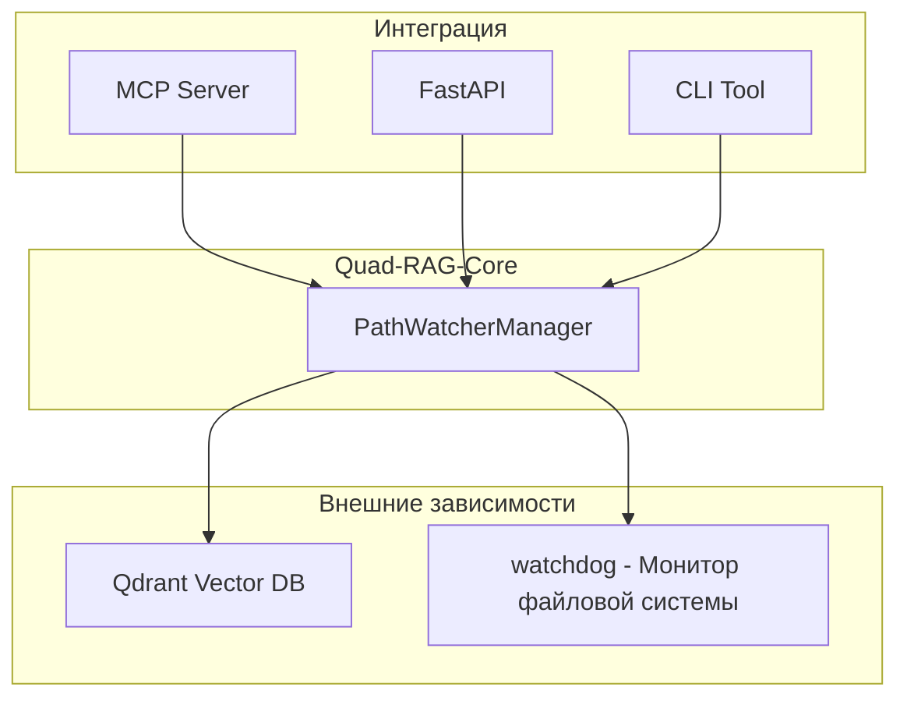

# Quad-RAG-Core

<div align="center">

**RAG движок семантического поиска для локальных файлов на базе Qdrant**


[English](README.md) | Русский

</div>

---

## Описание

**Quad-RAG-Core** — middleware модуль на Python для систем семантического поиска по локальным папкам с векторной базой данных Qdrant и автоматическим отслеживанием изменений файлов и поддержанием индекса.

### Основные возможности

🔍 **Автоматическое отслеживание файлов** — отслеживает создание, изменение, перемещение и удаление файлов через `watchdog`

🔄 **Автоматическое обновление индекса** — при изменении файла старые чанки удаляются, а новые пересчитываются

💾 **Сохранение состояния** — конфигурация хранится в Qdrant, автоматическое восстановление после перезапуска

🤖 **Локальные модели** — эмбеддинги через `nomic-embed-text-v2-moe`, ранжирование через `BGE-reranker-v2-m3`

📄 **Поддержка разных форматов файлов** — текстовые файлы (код, markdown, JSON) и PDF с несколькими бэкендами

🔌 **Адаптивность к фреймворкам** — легко интегрируется с MCP, FastAPI, CLI и другими

⚡ **Ускорение на GPU** — автоматическое использование CUDA при наличии

## Компоненты

| Компонент | Описание |
|-----------|-------------|
| [`PathWatcherManager`](quad_rag_core/path_manager.py) | Оркестратор — управляет watcher'ами, коллекциями Qdrant |
| [`RAGFileWatcher`](quad_rag_core/path_watcher.py) | Обработчик событий файловой системы через watchdog |
| [`QdrantManager`](quad_rag_core/qdrant_manager.py) | Обёртка над Qdrant Client |
| [`LocalEmbedder`](quad_rag_core/embedder.py) | Синглтон для эмбеддингов (nomic-embed-text) |
| [`LocalReranker`](quad_rag_core/reranker.py) | Синглтон для ранжирования (BGE-reranker) |
| [`FileProcessor`](quad_rag_core/file_processor.py) | Извлечение текста из файлов и чанкинг |
| [`config.py`](quad_rag_core/config.py) | Системная конфигурация |
| [`utils.py`](quad_rag_core/utils.py) | Утилиты: хеширование, MIME-типы, нормализация путей |

## Архитектура



## Поддерживаемые форматы файлов

### Текстовые файлы
- Языки программирования: `.py`, `.js`, `.ts`...
- Файлы конфигурации и скрипты: `.yaml`, `.yml`, `.toml`...
- Разметка и веб: `.md`, `.txt`, `.json`...

### PDF-файлы
Поддержка с тремя бэкендами для максимальной совместимости:
PyPDF2, PyMuPDF (fitz), pdfplumber](url)

---

## Установка

### Требования

- Python 3.10 или выше
- Qdrant server (по умолчанию: `localhost:6333`)
- Опционально: GPU, совместимый с CUDA для ускорения

### Установка зависимостей

```bash
pip install -r requirements.txt
```

### Запуск Qdrant

```bash
docker run -p 6333:6333 qdrant/qdrant
```

---

## Обзор интерфейса

```python
from quad_rag_core.path_manager import PathWatcherManager
from quad_rag_core.qdrant_manager import QdrantManager
from quad_rag_core.embedder import LocalEmbedder
from quad_rag_core.reranker import LocalReranker

# Инициализация
qdrant_manager = QdrantManager(host="localhost", port=6333)
embedder = LocalEmbedder()
path_manager = PathWatcherManager(qdrant_manager, embedder)

# Начать отслеживание папки
path_manager.watch_folder("/path/to/your/codebase", content_types=["text", "pdf"])

# Поиск
query_vector = embedder.embed_query("how does authentication work?")
results = qdrant_manager.search("how does authentication work?", query_vector, limit=10)

# Реранжирование для улучшения точности
reranker = LocalReranker()
chunks = [r.payload.get("content_preview", "") for r in results]
reranked = reranker.rerank("how does authentication work?", chunks, top_k=5)

# Вывод результатов
for chunk, score in reranked:
    print(f"Score: {score:.4f}")
    print(f"Content: {chunk[:200]}...")
    print("-" * 50)
```

### Получение статуса watcher'а папки

```python
# Получить статус всех отслеживаемых папок
folders = path_manager.get_watched_folders()

for folder in folders:
    print(f"Path: {folder['path']}")
    print(f"Status: {folder['status']}")
    print(f"Progress: {folder['progress_percent']}%")
    print(f"Collection: {folder['collection_name']}")
    print("-" * 50)
```

---


## Конфигурация

Все настройки находятся в [`config.py`](quad_rag_core/config.py):

```python
# Размер чанка (слова)
CHUNK_SIZE_WORDS = 150

# Перекрытие между чанками (15%)
CHUNK_OVERLAP_RATIO = 0.15

# Порог сходства для поиска
SEARCH_SCORE_THRESHOLD = 0.150

# Длина превью в payload
CHUNK_CHARACTERS_PREVIEW = 100

# Порог для реранжирования
RERANK_SCORE_THRESHOLD = 0.35
```

## Интеграция

### MCP Server (упрощенный пример)

```python
from quad_rag_core.path_manager import PathWatcherManager
from quad_rag_core.qdrant_manager import QdrantManager
from quad_rag_core.embedder import LocalEmbedder
from quad_rag_core.reranker import LocalReranker
from fastmcp import FastMCP

mcp = FastMCP("rag-mcp-server")

# Create manager
pm = PathWatcherManager(
    QdrantManager(host="localhost", port=6333),
    LocalEmbedder()
)

# MCP tools
@mcp.tool()
def watch_folder(path: str, content_types: list = ["text"]):
    """Start watching a folder"""
    pm.watch_folder(path, content_types)

@mcp.tool()
def search(query: str, collection: str, limit: int = 10):
    """Perform semantic search (simplified)"""
    embedder = LocalEmbedder()
    qdrant = QdrantManager()
    reranker = LocalReranker()
    
    # Vector search
    vector = embedder.embed_query(query)
    hits = qdrant.search(collection, vector, limit=limit)
    
    # Reranking
    chunks = [r.payload.get("content_preview", "") for r in hits]
    reranked = reranker.rerank(query, chunks, top_k=limit)
    
    results=  [
        {"content": chunk, "score": float(score)}
        for chunk, score in reranked
    ]
    return {
        "status": "success",
        "results": results
    }
```

### FastAPI веб-интерфейс (упрощенный пример)

```python
from fastapi import FastAPI
from quad_rag_core.path_manager import PathWatcherManager
from quad_rag_core.qdrant_manager import QdrantManager
from quad_rag_core.embedder import LocalEmbedder
from quad_rag_core.reranker import LocalReranker

app = FastAPI()
pm = PathWatcherManager(QdrantManager(), LocalEmbedder())

@app.post("/watch")
async def watch_folder(path: str, content_types: list = ["text"]):
    """Начать отслеживание папки"""
    pm.watch_folder(path, content_types)
    return {"status": "watching", "path": path}

@app.get("/search")
async def search(query: str, collection: str, limit: int = 10):
    """Выполнить семантический поиск"""
    embedder = LocalEmbedder()
    qdrant = QdrantManager()
    reranker = LocalReranker()
    
    vector = embedder.embed_query(query)
    results = qdrant.search(collection, vector, limit=limit)
    
    chunks = [r.payload.get("content_preview", "") for r in results]
    reranked = reranker.rerank(query, chunks, top_k=limit)
    
    return {
        "query": query,
        "results": [
            {"content": chunk, "score": float(score)}
            for chunk, score in reranked
        ]
    }

@app.get("/status")
async def get_status():
    """Получить статус всех watcher'ов"""
    return pm.get_watched_folders()

@app.delete("/unwatch")
async def unwatch_folder(path: str):
    """Прекратить отслеживание папки"""
    pm.unwatch_folder(path)
    return {"status": "unwatched", "path": path}
```

---

## Используемые модели

### Эмбеддинги

- **Модель**: `nomic-ai/nomic-embed-text-v2-moe`
- **Размер вектора**: 768
- **Метрика**: COSINE
- **Двойной промпт**: `passage` для документов, `query` для запросов

### Реранкинг

- **Модель**: `BAAI/bge-reranker-v2-m3`
- **Тип**: Cross-encoder
- **Максимальная длина последовательности**: 512

## Особенности архитектуры

### Паттерн Singleton для AI-моделей
[`LocalEmbedder`](quad_rag_core/embedder.py:6) и [`LocalReranker`](quad_rag_core/reranker.py:6) используют Singleton для эффективного использования GPU-памяти.

### Сохранение состояния
Конфигурация watcher'а сохраняется в Qdrant как метаданные с фиксированным UUID для автоматического восстановления состояния после перезапуска сервиса.

### Мульти-бэкенд извлечение PDF
Три бэкенда для извлечения текста из PDF с автоматическим фолбэком: PyPDF2 → PyMuPDF → pdfplumber.

---

## Устранение неполадок

### Qdrant недоступен

```bash
# Проверить, запущен ли Qdrant
docker ps | grep qdrant

# Запустить Qdrant
docker run -p 6333:6333 qdrant/qdrant
```

### Медленная скорость индексации

- Используйте GPU для ускорения эмбеддингов
- Уменьшите размер чанка в [`config.py`](quad_rag_core/config.py)
- Убедитесь, что Qdrant работает на том же хосте

### Области для улучшения

- Дополнительные форматы файлов (Word, Excel, изображения)
- Распределённое хранилище Qdrant
- Метрики и мониторинг
- Дополнительные модели эмбеддингов и реранжирования

## Лицензия

MIT License

## Благодарности

- [Qdrant](https://qdrant.tech/) — Векторная база данных
- [sentence-transformers](https://www.sbert.net/) — Библиотека для эмбеддингов и реранжирования
- [watchdog](https://python-watchdog.readthedocs.io/) — Мониторинг файловой системы
- [Nomic AI](https://nomic.ai/) — Модель nomic-embed-text-v2-moe
- [BAAI](https://github.com/FlagOpen/FlagEmbedding) — Модель BGE-reranker-v2-m3

## Автор
[Александр Казанцев](https://habr.com/ru/users/akazant/articles/), 2025 
<div align="center">

**Создано для open-source сообщества** 🚀

</div>
